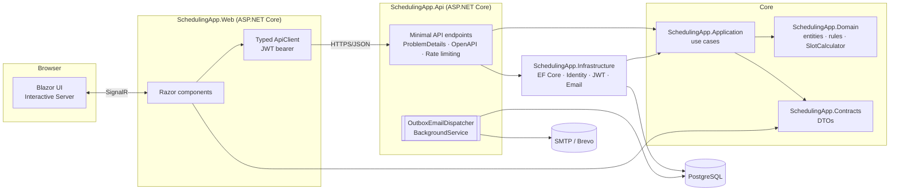
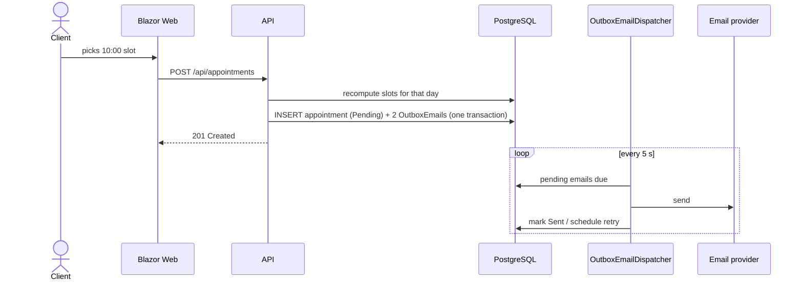
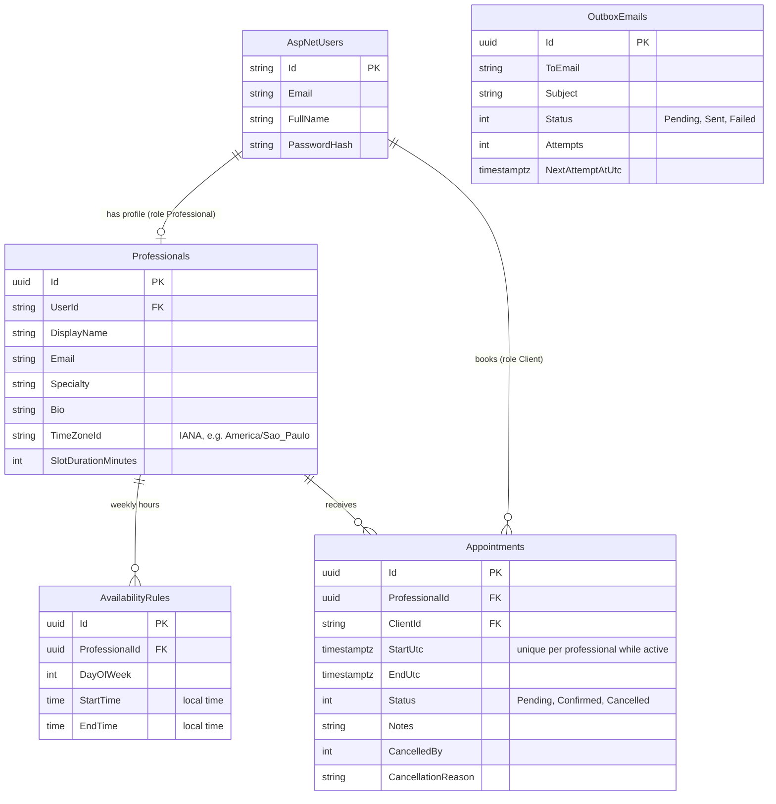
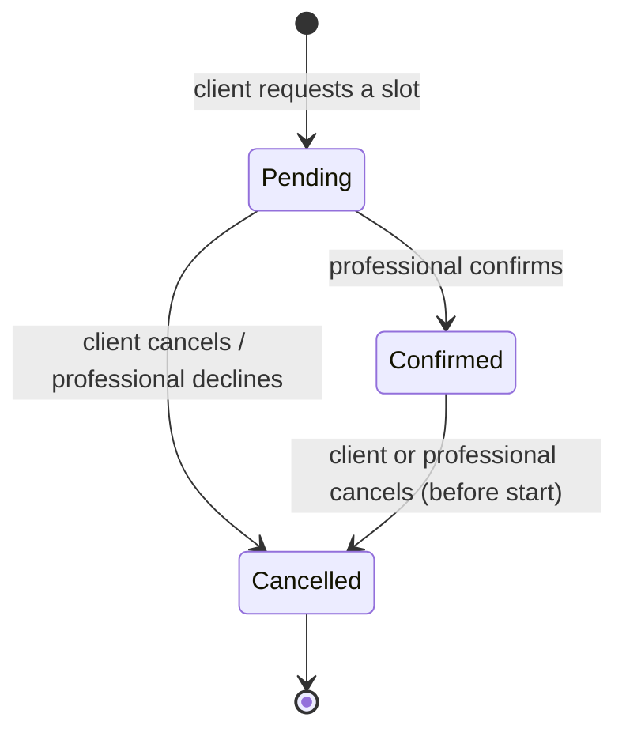

# Architecture

Scheduling App is a full-stack .NET 10 application organised with **Clean Architecture**: business rules in the
centre, frameworks at the edges. Every arrow below points *inwards* (towards fewer dependencies).

| Project | Responsibility | Depends on |
|---|---|---|
| `SchedulingApp.Domain` | Entities, state transitions (`Appointment.Confirm/Cancel`), `SlotCalculator`, business errors | nothing |
| `SchedulingApp.Contracts` | HTTP request/response records shared by API and front-end | nothing |
| `SchedulingApp.Application` | Use cases (`AppointmentService`, `AvailabilityService`, …), ports (`IAppDbContext`, `IEmailSender`, `IAuthService`), email composition | Domain, Contracts, EF Core abstractions |
| `SchedulingApp.Infrastructure` | EF Core + PostgreSQL, ASP.NET Core Identity, JWT, outbox dispatcher, SMTP/Brevo senders, seeding | Application |
| `SchedulingApp.Api` | Minimal API endpoints, auth policies, ProblemDetails, OpenAPI, health checks | Infrastructure |
| `SchedulingApp.Web` | Blazor Web App (Interactive Server). Talks to the API **only over HTTP** | Contracts |

## Key decisions

### Time zones done right
Professionals define weekly hours in **their own local time** (`Professional.TimeZoneId`, IANA id).
`SlotCalculator` converts local slots to UTC, skips non-existent local times on DST changes and
the database only stores UTC (`timestamptz`). The API returns `DateTimeOffset` values in the
professional's offset, so the UI always shows the professional's clock with a time-zone label.

### No double booking
1. The use case recomputes the slots and only accepts a start time that is offered and free.
2. A **partial unique index** (`ProfessionalId, StartUtc WHERE Status <> Cancelled`) makes the database reject
   concurrent requests that passed step 1 at the same time. The violation is mapped to `409 Conflict`.
   An integration test fires 6 parallel bookings and asserts exactly one succeeds.

### Transactional outbox for emails
Booking, confirmation and cancellation write rows to `OutboxEmails` **in the same `SaveChanges`** as the
appointment change. `OutboxEmailDispatcher` (a `BackgroundService`) delivers them with exponential backoff
(30 s, 1 min, 2 min, …, max 5 attempts).
This replaces the RabbitMQ + worker design: same reliability guarantees (no lost email, no email for a rolled-back
change), zero extra infrastructure, so the app runs on free hosting tiers.

### Authentication
ASP.NET Core Identity (password hashing, lockout after 5 failures) + stateless **JWT** with `role` and
`professional_id` claims. Authorization policies `Client` and `Professional` protect the endpoints, and ownership is
checked inside the use cases (another professional gets `404`, not `403`, so ids are not leaked).
The Blazor app keeps the token in `ProtectedLocalStorage` (encrypted with Data Protection).

### Errors
Application exceptions → RFC 7807 `ProblemDetails` with a stable `code` (e.g. `slot.taken`) via `IExceptionHandler`:

| Exception | HTTP |
|---|---|
| `ValidationException` | 400 (with `errors` dictionary) |
| `UnauthorizedException` | 401 |
| `ForbiddenException` | 403 |
| `NotFoundException` | 404 |
| `ConflictException` | 409 |
| `DomainException` | 422 |

## Data model

### Appointment lifecycle

## API overview

| Method | Route | Who |
|---|---|---|
| POST | `/api/auth/register` · `/api/auth/login` | anyone |
| GET | `/api/auth/me` | signed in |
| GET | `/api/professionals?search=` · `/{id}` · `/{id}/availability` · `/{id}/slots?date=` | anyone |
| GET/PUT | `/api/professionals/me` | Professional |
| GET/POST/DELETE | `/api/professionals/me/availability[/{ruleId}]` | Professional |
| POST | `/api/appointments` | Client |
| GET | `/api/appointments/mine` | Client |
| GET | `/api/appointments/schedule?from=&to=` | Professional |
| POST | `/api/appointments/{id}/confirm` | Professional |
| POST | `/api/appointments/{id}/cancel` | owner (Client or Professional) |

Interactive docs: `/docs` (Swagger UI over the built-in `/openapi/v1.json`). Health: `/health`.
